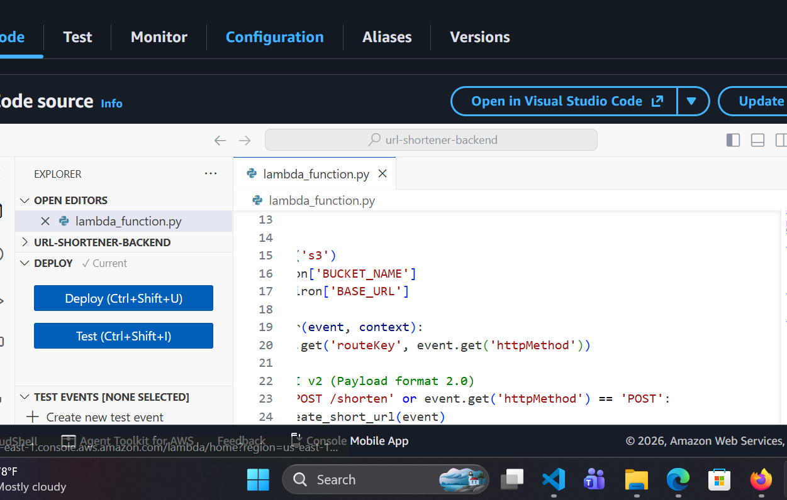
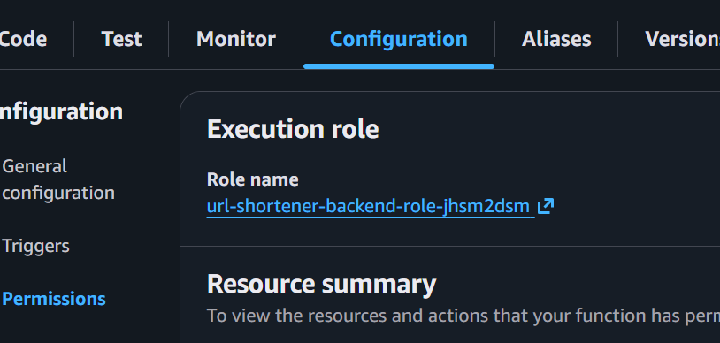
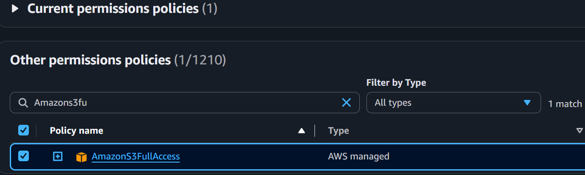
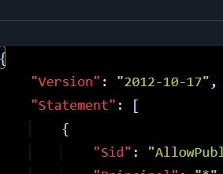
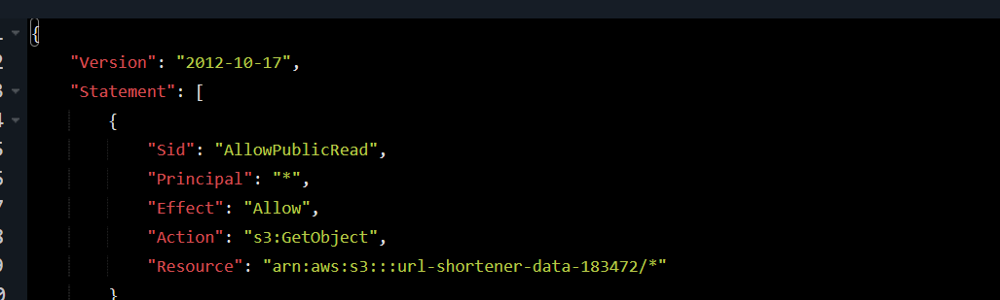
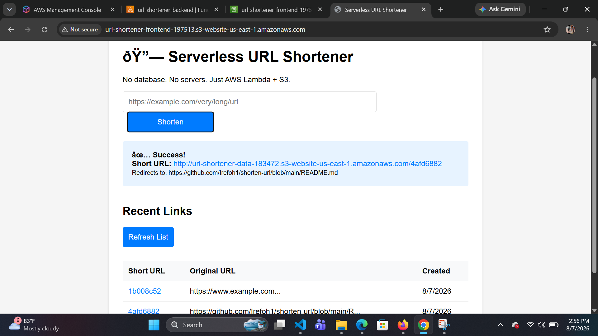

# AWS URL SHORTENER

A serverless URL shortener built with AWS Lambda, API Gateway, and S3. This project allows users to shorten long URLs and access them via a custom short link.

## PREREQUISITES

AWS account with appropriate permissions

Basic knowledge of AWS services (S3, Lambda, API Gateway)

Text editor for code modifications

## STEPS

### Create S3 Bucket

You will need two S3 bucket

BUCKET A - URL Storage

Go to S3 → Create bucket
Bucket name: url-shortener-data-183472 (must be globally unique, add random numbers)

Region: Choose closest to you (e.g., us-east-1)

Block Public Access settings:

UNCHECK "Block all public access" (you will need public access for redirects)

Check the acknowledgment box

Click Create bucket

Bucket B - The Frontend

Create another bucket: url-shortener-frontend-197513

Uncheck "Block all public access" again

### Configure Static Website Hosting

Go to S3  console

Select your bucket

Go to Properties → Static website hosting

Enable and set:
Index document: index.html
Error document: error.html

Do this for both buckets

#Deploy Lambda Function

Go to Lambda → Create function

Function name: url-shortener-backend

Runtime: Python 3.14

Architecture: x86_64

Click Create function

## Configure Environment Variable

In the function page:

Configuration tab → Environment variables → Edit

Add two variables:

BUCKET_NAME = url-shortener-data-183472 (your first bucket name)

BASE_URL =  = http://url-shortener-data-183472.s3-website-us-east-1.amazonaws.com  (the URL from Step 1)

Save

Add the code

Replace the code with the contents of lambda_function.py in this repository
Click Deploy after adding the code

Add necessary permissions
You need to give the default lambda execution role permissions to your S3 buckets:

On the url-function-backend on Lambda, click configuration, then click permissions

On this page, you will see the lambda executor role, click on it and it will take you to IAM.

On the IAM page, click on add permissions, then select attach policies and search for AmazonS3FullAccess permission.

Create API Gateway

Use HTTP API (cheaper, simpler CORS).

Go to API Gateway → Create API

Click Build under "HTTP API" (not REST API)

Add integration:

Integration type: Lambda

Lambda function: Select
 url-shortener-backend Version: 2.0 (latest) 
 
 Click Create

Create Routes 

Click Next to Routes, then Create these:

 ### Route 1: Create URL

Method: POST

Resource path: /shorten

Integration target: Select your Lambda

Create

### Route 2: Get Stats

Method: GET

Resource path: /stats

Integration target: Select your Lambda

Create

### Route 3: CORS Preflight (Important!)

Method: OPTIONS

Resource path: /{proxy+} (this catches all paths)

Integration target: Select your Lambda

Create

Configure CORS

Click Next until you see Configure CORS:

Access-Control-Allow-Origin: *

Access-Control-Allow-Methods: GET, POST, OPTIONS

Access-Control-Allow-Headers: Content-Type Authorization

Click Next → Create

Get your API Endpoint

        

        
Once created, you'll see an Invoke URL at the top (looks like: https://ueliai74e.execute-api.us-east-1.amazonaws.com) 

Copy this URL - you need it for the frontend.

 Deploy Frontend to S3

Go to S3 → Your frontend bucket (url-shortener-frontend-197513)

Upload → Add files → Select your index.html

Click Upload
Make it Public

Go to Permissions tab of the bucket

Bucket Policy → Edit

input the  correct policy (replace your-bucket-name)

Save changes

##Set Content-Type (Important)

Go back to Objects tab

Click on index.html

Properties tab → Metadata

Ensure Content-Type is text/html (not binary/octet-stream)

If not, click Edit, set Key: Content-Type, Value: text/html

 Fix S3 Redirect Bucket Policy

Your URL storage bucket also needs to be readable for the redirects to work:

Go to S3 → url-shortener-data-183472 → Permissions

Bucket Policy → Edit

Input the correct policy as seen 

# USAGE

## Shorten a URL

curl -X POST \
  https://your-api-id.execute-api.us-east-1.amazonaws.com/shorten \
  -H "Content-Type: application/json" \
  -d '{"url":"https://www.example.com"}'

  ## Reponse

  {
  "shortUrl": "http://bucket.s3-website-us-east-1.amazonaws.com/abc123",
  "shortCode": "abc123",
  "originalUrl": "https://www.example.com"
}

## Access Short URL

Visit the returned shortUrl in your browser to be redirected to the original URL.

# FRONTEND INTERFACE

Open your S3 static website URL in a browser

Enter a long URL in the input field

Click "Shorten"

Copy the generated short URL

Here is a photo of how the frontend is

## Custom Domain Setup (Optional)

For shorter URLs like https://go.yourdomain.com/abc123:

Purchase a domain through Route 53 or another registrar

Create a CloudFront distribution pointing to your S3 bucket

Set up DNS records to point to CloudFront

# Troubleshooting

## Common Issues

Failed to fetch: Check CORS configuration in API Gateway

Redirect not working: Verify S3 static website hosting is enabled

Empty bucket: Check Lambda execution role permission

Access Denied when clicking short link? :
Check Bucket Policy on url-shortener-data-183472

Ensure "Block Public Access" is disabled on the bucket

# Debugging Steps

Check CloudWatch logs for Lambda errors

Verify API Gateway CORS settings

Inspect S3 object metadata for redirect configuration
# Cleanup

To avoid ongoing charges:

Delete the S3 bucket and all contents
aws s3 rb s3://your-bucket-name --force

Delete the Lambda function
aws lambda delete-function --function-name url-shortener-backend

Delete the API Gateway
aws apigateway delete-api --api-id your-api-id

